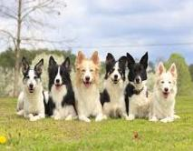
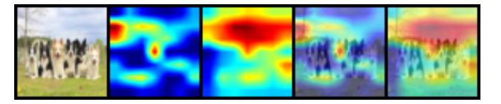

# Pytorch-cifar10 with albumentation and GradCam
90% on CIFAR10 with PyTorch

## Prerequisites
* Python 3.7+

* PyTorch 6.0+

## Accuracy

Model         | Accuracy
------------- | -------------
[ResNet18](https://arxiv.org/abs/1512.03385)     | 90 %

## 40 Epochs used
* Test set: Average loss: 0.0054, Accuracy: 90%

## Before start we need to install below packages
* pip install pytorch-gradcam
* pip install albumentation

### Albumentation
* HorizantalFlip
* Cutout
* RandomContrast
* RandomBrightness
* HueSaturationValue

### GradCam

* #### GradCam Input Image

* #### GradCam Output Image

